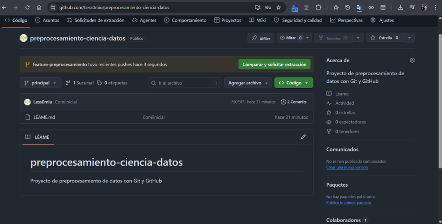
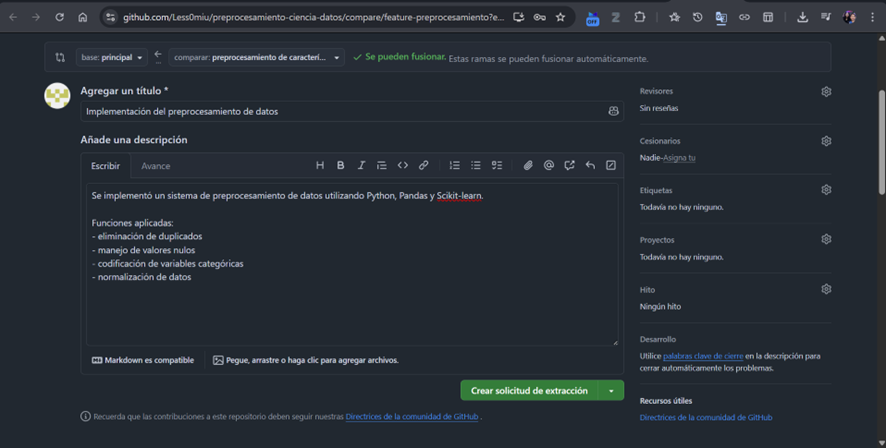
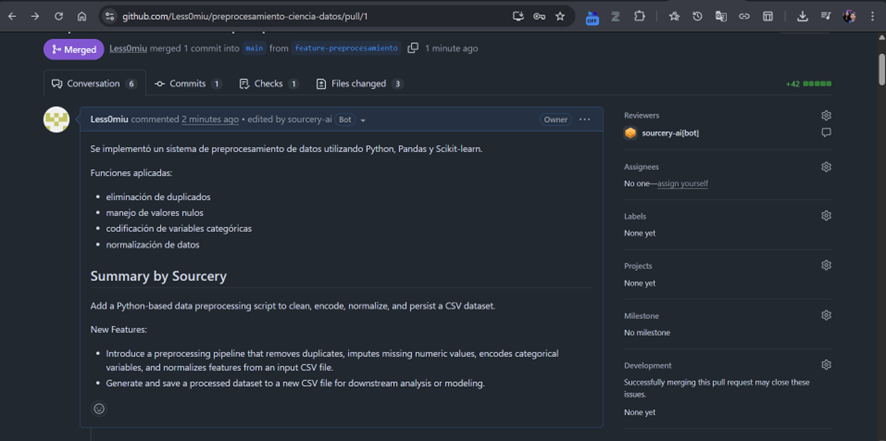
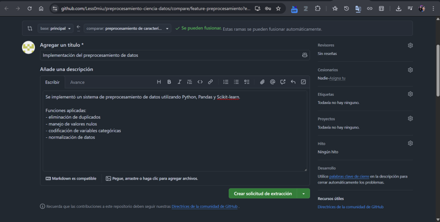
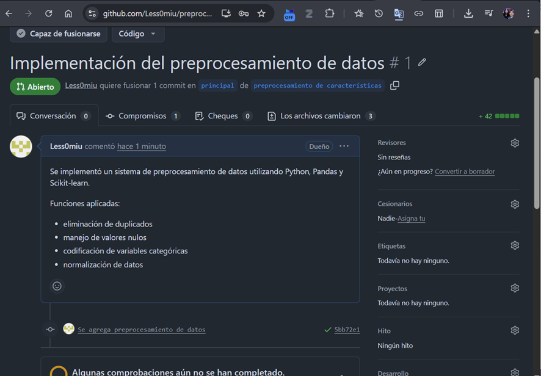

# DOCUMENTACIÓN DEL PROYECTO - PREPROCESAMIENTO CIENCIA DE DATOS

**Autor:** Lesly Carrasco
**Curso:** Cultura Digital y Sociedad - Tercer Semestre
**Institución:** Universidad Nacional de Chimborazo
**Fecha:** 11 de mayo de 2026


# 1. Introducción

## 1.1 Objetivo del Proyecto

El objetivo de este proyecto fue implementar técnicas básicas de preprocesamiento de datos utilizando Python, Pandas y Scikit-learn, aplicando además control de versiones con Git y GitHub para la gestión y organización del proyecto.

El propósito principal fue limpiar, transformar y preparar un conjunto de datos para facilitar futuros análisis y aplicaciones relacionadas con ciencia de datos y machine learning.


## 1.2 Funcionalidades Implementadas

El sistema desarrollado realiza las siguientes tareas:

* Eliminación de datos duplicados.
* Manejo de valores nulos.
* Conversión de variables categóricas a formato numérico.
* Normalización de datos.
* Exportación automática del dataset procesado.


# 2. Comandos Git Utilizados

## 2.1 Configuración Inicial del Repositorio

```bash
git init
git add .
git commit -m "Initial commit"
git remote add origin https://github.com/Less0miu/preprocesamiento-ciencia-datos.git
git push -u origin main
```

### Propósito

Inicializar el repositorio local, realizar el primer commit y conectarlo con el repositorio remoto en GitHub.


## 2.2 Creación y Gestión de Ramas

```bash
git checkout -b feature-preprocesamiento
```

### Propósito

Crear una rama de desarrollo llamada `feature-preprocesamiento` para trabajar en nuevas funcionalidades sin afectar la rama principal `main`.


## 2.3 Agregar y Confirmar Cambios

```bash
git add .
git commit -m "Ejecución exitosa del preprocesamiento de datos"
```

### Propósito

* `git add .` → Añade todos los archivos modificados al área de staging.
* `git commit` → Guarda una nueva versión del proyecto con un mensaje descriptivo.


## 2.4 Subir Cambios al Repositorio Remoto

```bash
git push origin feature-preprocesamiento
```

### Propósito

Subir la rama local `feature-preprocesamiento` al repositorio remoto en GitHub para su revisión y posterior fusión.


## 2.5 Actualizar Rama Main

```bash
git checkout main
git pull origin main
```

### Propósito

Cambiar a la rama principal y sincronizarla con los cambios fusionados desde el repositorio remoto.


## 2.6 Eliminar Rama Después del Merge

```bash
git branch -d feature-preprocesamiento
```

### Propósito

Eliminar la rama de desarrollo local una vez que ha sido fusionada exitosamente con `main`, manteniendo el repositorio limpio.


# 3. Automatización con GitHub Actions

## 3.1 Workflow Configurado

El archivo:

```plaintext
.github/workflows/preprocesamiento.yml
```

implementa un sistema de Integración Continua (CI) utilizando GitHub Actions.

Este workflow automatiza las siguientes tareas:

* Clonado automático del repositorio.
* Configuración del entorno de Python.
* Instalación automática de dependencias.
* Ejecución del script `preprocesamiento.py`.
* Verificación del correcto funcionamiento del proyecto.


## 3.2 ¿Qué Hace GitHub Actions?

### Trigger (Activación)

El workflow se ejecuta automáticamente cuando:

* Se realiza un `push` a las ramas `main` o `feature-preprocesamiento`.
* Se crea o actualiza una Pull Request.


### Entorno de Ejecución

GitHub Actions:

* Utiliza una máquina virtual con Ubuntu (Linux).
* Configura automáticamente Python 3.14.


### Proceso Automatizado

El workflow realiza automáticamente:

1. Instalación o actualización de `pip`.
2. Instalación de dependencias:

   * `pandas`
   * `scikit-learn`
   * `numpy`
3. Ejecución automática del script `preprocesamiento.py`.


### Resultado

*  Si el script se ejecuta correctamente → Workflow exitoso.
*  Si existen errores → Workflow fallido.


## 3.3 Beneficios de GitHub Actions

### Detección temprana de errores

Permite identificar problemas antes de fusionar cambios al proyecto principal.


### Validación automática

Asegura que el código funcione correctamente en un entorno limpio y automatizado.


### Calidad del código

Ayuda a mantener buenas prácticas y estándares profesionales de desarrollo.


### Ahorro de tiempo

Reduce la necesidad de realizar pruebas manuales repetitivas.


## 3.4 Código del Workflow

```yaml
name: Preprocesamiento CI

on:
  push:
    branches: [ main, feature-preprocesamiento ]
  pull_request:
    branches: [ main ]

jobs:
  build:
    runs-on: ubuntu-latest
    
    steps:
    - uses: actions/checkout@v3
    
    - name: Set up Python
      uses: actions/setup-python@v4
      with:
        python-version: '3.14'
    
    - name: Install dependencies
      run: |
        python -m pip install --upgrade pip
        pip install pandas scikit-learn numpy
    
    - name: Run preprocesamiento.py
      run: python preprocesamiento.py
```


# 4. Capturas de Pantalla

## 4.1 Ejecución del Script en Terminal

### Descripción

Salida del script `preprocesamiento.py` ejecutado desde la terminal mostrando:

* Dataset original.
* Eliminación de duplicados.
* Manejo de valores nulos.
* Conversión de variables categóricas.
* Normalización de datos.
* Dataset procesado final.

### Evidencia

(Procesamiento.image)


## 4.2 Comandos Git Ejecutados






## 4.3 Pull Request en GitHub



## 4.4 Merge de la Rama




# 5. Explicación del Script de Preprocesamiento

El archivo `preprocesamiento.py` fue desarrollado utilizando Python, Pandas y Scikit-learn.

## Procesos realizados

### Lectura del Dataset

```python
pd.read_csv("datos.csv")
```

Permite cargar el dataset original desde un archivo CSV.


### Eliminación de Duplicados

```python
df.drop_duplicates()
```

Elimina filas repetidas del dataset.


### Manejo de Valores Nulos

```python
df.fillna(df.mean())
```

Rellena valores faltantes utilizando la media de las columnas numéricas.


### Conversión de Variables Categóricas

```python
pd.get_dummies(df)
```

Convierte variables categóricas a formato numérico.


### Normalización de Datos

```python
MinMaxScaler()
```

Escala los valores numéricos al rango entre 0 y 1.


# 6. Resultados Obtenidos

## 6.1 Preprocesamiento Aplicado

| Proceso                 | Resultado                         |
| ----------------------- | --------------------------------- |
| Dataset original        | 5 filas, 3 columnas               |
| Dataset procesado       | 4 filas, 6 columnas               |
| Duplicados eliminados   | 1 fila                            |
| Valores nulos imputados | 1 valor (`Ingreso`)               |
| Variables categóricas   | `Ciudad` → 4 columnas binarias    |
| Normalización           | `Edad` e `Ingreso` en rango [0,1] |


## 6.2 Transformaciones Realizadas

### Drop Duplicates

Se eliminó la fila con índice `2`, ya que era idéntica a la fila `1`.


### Fill Na

El valor `NaN` de la columna `Ingreso` fue reemplazado por la media:

```plaintext
700.0
```


### Get Dummies

La columna `Ciudad` fue convertida en variables binarias:

* `Ciudad_Cuenca`
* `Ciudad_Guayaquil`
* `Ciudad_Loja`
* `Ciudad_Quito`


### MinMaxScaler

Las columnas numéricas fueron normalizadas al rango `[0,1]`.

#### Columna Edad

```plaintext
[20, 25, 30, 35] → [0.0, 0.33, 0.67, 1.0]
```

#### Columna Ingreso

```plaintext
[500, 700, 900] → [0.0, 0.5, 1.0]
```


# 7. Conclusiones

*  Se logró implementar un pipeline básico de preprocesamiento de datos.
*  Se aplicaron buenas prácticas de control de versiones con Git y GitHub.
*  Se automatizó la validación del código utilizando GitHub Actions.
*  El proyecto quedó preparado para futuras mejoras y ampliaciones.
*  Se fortalecieron conocimientos sobre limpieza, transformación y automatización de datos.


# 8. Bibliografía

* Chacon, S., & Straub, B. (2014). *Pro Git*. Apress.
* McKinney, W. (2018). *Python for Data Analysis*. O'Reilly Media.
* Documentación oficial de Pandas: [https://pandas.pydata.org/](https://pandas.pydata.org/)
* Documentación oficial de Scikit-learn: [https://scikit-learn.org/](https://scikit-learn.org/)
* Documentación oficial de GitHub Actions: [https://docs.github.com/actions](https://docs.github.com/actions)

